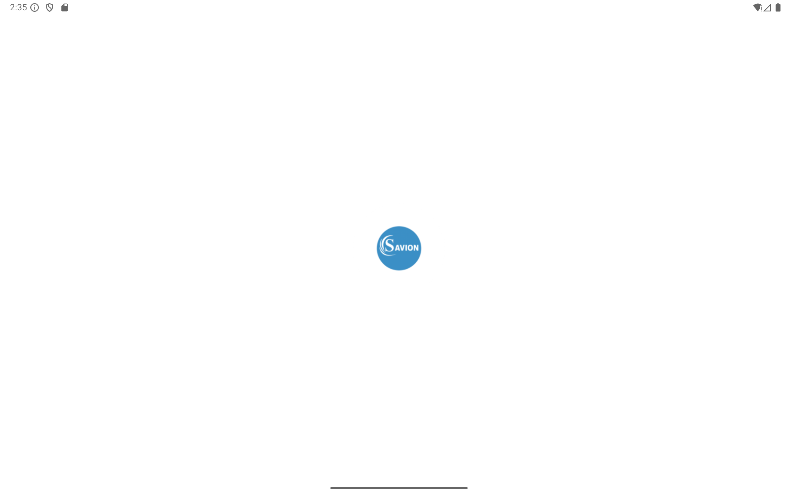
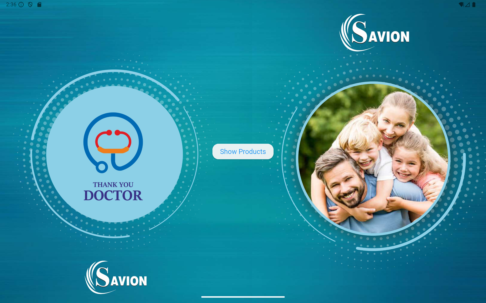
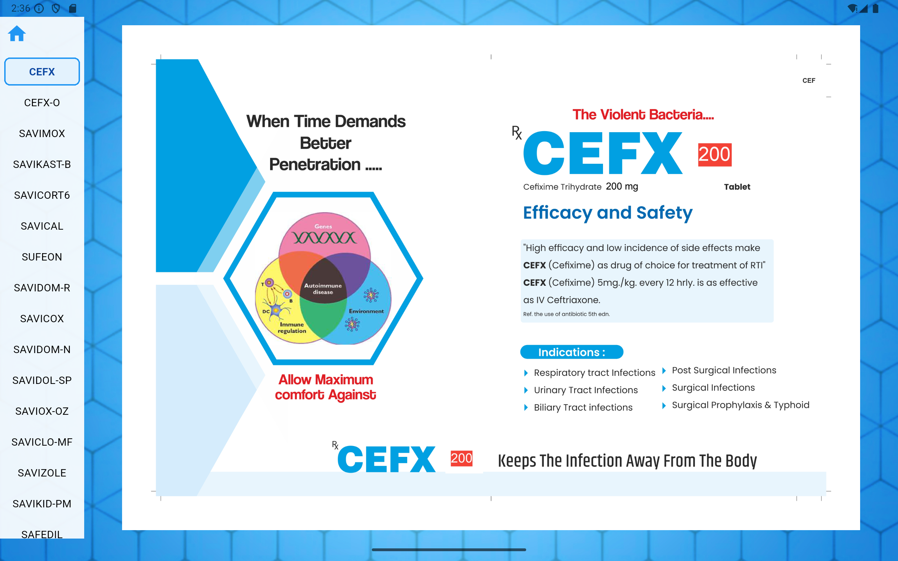
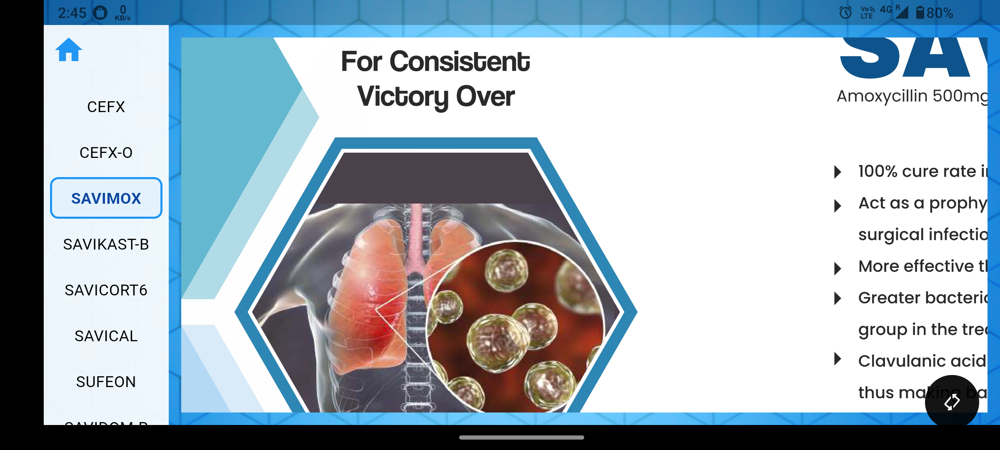

# Savion Flutter App

A Flutter-based product catalog app developed for **[Savion Life Sciences]**, featuring a fully custom UI, strict asset management, and dynamic navigation.

---

##  Custom Design & Asset Policy

All images, logos, and UI elements in this app were **designed and implemented according to strict customer requirements and brand guidelines**.

- Every asset was created, named, and placed with direct customer approval.
- The UI layout, color palette, and iconography follow the client's brand guidelines.

---

##  Features

- Custom home and product backgrounds
- Interactive side menu for product selection
- Zoomable product images
- Offline asset management (all images and products are bundled with the app)
- Custom launcher icon and app name
- Built and optimized for Android devices

---

##  Screenshots

| Logo                | Home Screen         | Product Detail         | Zoom Feature         |
|---------------------|--------------------|-----------------------|---------------------|
|    |   |  |  |

---

##  Download & Installation

**Latest APK Download:**  
[Download the latest APK from Google Drive](https://drive.google.com/drive/folders/1QtRzfJ8wZAWeigDCpOEOKQ6JYy_PZTUJ)

### **How to Install and Use the App:**

1. **Download the APK**
   - Click the link above to open the Google Drive folder.
   - Right-click on the APK file and select **Download**.
2. **Transfer to Your Android Device**
   - Move the APK to your phone via USB, email, or cloud storage.
3. **Install the APK**
   - On your device, open the APK file.
   - If prompted, allow installation from unknown sources.
   - Complete the installation process.
4. **Launch the App**
   - Open the app from your app drawer.
   - Explore the custom-designed catalog interface, browse products, and zoom product images.

---

##  About This Project

This Flutter app was developed as a client project for **[Savion Life Sciences]**.

**What I did:**
- Designed the entire user interface according to the client specifications.
- Integrated all company-provided product images and homepage assets per strict brand guidelines.
- Designed the app’s background and user interface.
- Developed the app using Flutter and Dart for a seamless, cross-platform experience.
- Implemented a custom navigation system with a persistent side menu for instant product access.
- Integrated a zoom feature for product images and ensured all assets work offline.
- Managed all digital assets and APK distribution, including secure Google Drive hosting for large files.

> **Note:** All assets are proprietary and not for reuse.

---

##  License

This project is proprietary and was developed for **[Savion Life Sciences]** with permission to showcase for portfolio purposes.

---

## 💡 Notes

- For privacy and client confidentiality, only non-sensitive assets and code are included.

---
